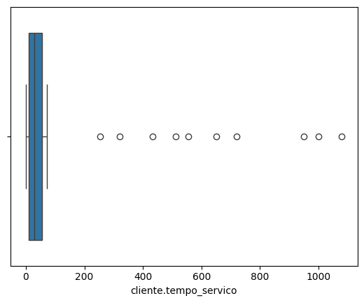
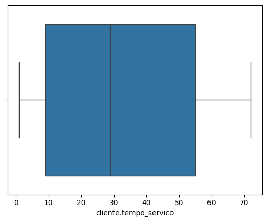

EN
# Data cleaning and processing

*Objective: Processing the database to remove null data, duplicates, features or categorical columns. Leaving the database ready to be added to a machine learning model.*

Some columns were in a nested format, which made analysis difficult. To solve this, we used the json_normalize() method, and transformed it into a more appropriate format, thus creating new columns from the JSON keys.

Dataset-telecon.json was used using the with() method, which ensures that the file is closed after use.

We visualized the first five lines of the normalized DataFrame, where we could see how the columns were structured from the original JSON.

PT-BR

# Limpeza e tratamento de dados

*Objetivo: Tratamento na base de dados para retirar dados nulos, duplicatas, feature ou colunas categoricas. Deixando a base de dados
pronta para ser adicionada em um modelo de machine learning.*

Algumas colunas estavam em um formato aninhado, o que dificultava a análise. Para resolver isso, utilizamos o método json_normalize(), e transformando e um formato mais adequado, assim criando novas colunas a partir das chaves do JSON.

Foi usado dataset-telecon.json ultilizando o método with(), que garante o fechamento do arquivo após o uso.

Visualizamos as primeiras cinco linhas do DataFrame normalizado, onde pudemos observar como as colunas foram estruturadas a partir do JSON original.

Analisando os dados normalizados o conta.cobranca.Total não esta como um dado numerico, então vai ser feito o tratamento do dado para ser ultilizado. Antes de transformar usando o astype, vamos verificar para ver ele contem $ sifrão. Aplicando o filtro para todo dado referenciado no == ser transformado por " " espaço em branco 

Após verificar cliente.tempo_servico, conta.contrato, conta.cobranca.mensal e conta.cobranca.Total. Foi visto que valores de cliente.tempo_servico está 0.0 para obter o valor deles sera multiplicado oliente.tempo_servico (24 meses) por conta.cobranca.mensal para inferir o valor de conta.cobranca.Total.

Após salvar index de conta.cobranca.Total, com dados_normalizados pegamos nosso idx que tem o valor dele para ser igual aos nossos dados normalizado so que multiplicação por 24.

Com isso, nossos valores foram inseridos.usando comando dados_normalizados.loc, informando o [idx] com os índices que estamos usando.

Assim ficando pronto para modificar os dados para float e usando o .info vimos que agora o conta.cobranca.Total esta no tipo float.

Vamos visualizar o conteúdo presente em cada coluna de dados_normalizados. Onde há um for que percorrerá cada nome, dentro do qual fazemos três prints que passam:

    for col in dados_normalizados.columns:
        print(f"Coluna: {col}")
        print(dados_normalizados[col].unique())
        print("-"*30)

Após fazer o cast da nossa coluna, e transformar o seu tipo para float. Foi observado que o conteúdo em cada coluna de dados_normalizados.

Uma f-string para visualizar o nome da coluna{col} a cada repetição do laço
Uma referência da coluna visualizada junto aos valores únicos presentes nela
Um "-" * 30 para exibir 30 traços para organização do retorno.

Os valores numéricos possuem, obviamente, mais valores únicos se comparados aos valores textuais.
Na coluna Churn, além de "não" e "sim", temos um valor estranho: ''. Vamos investigá-lo.
Churn informa se determinada pessoa cliente deixou de assinar os serviços da empresa ou não. Neste caso, o valor '' não diz nada nem acrescenta informações, portanto vamos tratá-lo.

Vamos adicionar um dados_normalizados.query() cujos parênteses receberão o comando Churn == '' entre aspas duplas. Por meio dele, informamos que queremos filtrar os locais onde o nome da coluna a ser manipulada (Churn) é igual à string vazia.

Queremos todas as amostras que sejam diferentes de um valor vazio. Para isso, à direita de dados_normalizados['Churn'], adicionaremos a expressão != junto a um par de aspas simples que representa este valor vazio.

Em seguida vamos resetar o index do dados_sem_vazio para podermos ulizar lembrando que drop vai dropar os indece antigo e inplace para aplicar os novos

Foi verificado se existem amostrar duplicadas, com duplicated(), e com metodo sum() vimos que existem 75 dados duplicados.

Entre os colchetes passamos filtro_duplicadas. Dessa forma, vamos verificar quais são as amostras duplicadas.

    dados_sem_vazio[filtro_duplicadas]

Uma das inteções quando se tem duplicadas é sua remoção, qual seria um bom para fazer essa remoção?

- Viés do modelo: se há amostras duplicadas no conjunto de dados, pode ser que o modelo de machine learning dê mais importância para essas amostras repetidas.

- Melhora do desempenho do modelo: se inserimos amostras duplicadas, vão ser necessários mais cálculos e poder de processamento, além de ser um desperdício computacional trabalhar com amostras com o mesmo valor e que transmitem a mesma informação.

- Aumento da qualidade dos resultados: vamos inserir informações únicas, sem dados repetidos. Ou seja, vão ser mais relevantes para o modelo.

A biblioteca Pandas oferece o método drop_duplicates() para retirar amostras duplicadas.

    dados_sem_vazio.drop_duplicates(inplace=True)

# Dados Nulos

No nosso dados_sem_vazio vamos ultilizar o isna() para verificar se exitem valores vazios

Após executar a célula, temos um total de 114 valores nulos no conjunto de dados. Mas, essa não é a quantidade de amostras com valores nulos, porque algumas amostras podem possuir mais de um valor nulo.

Vamos verificar a informação de quantas amostras diferentes possuem dados nulos.

Para isso, vamos fazer um filtro ao escrever dados_sem_vazio[]. Entre os colchetes, repetimos dados_sem_vazio e usamos o método .isna().any(), passando axis igual à 1 para fazer referência a coluna.

    dados_sem_vazio[dados_sem_vazio.isna().any(axis=1)]

Aplicando o filtro:

    dados_sem_vazio[filtro][["cliente.tempo_servico", "conta.cobranca.mensal", "conta.cobranca.Total"]]

Os valores da coluna "cliente.tempo_servico" são representados pela NaN que significa not a number (não é um número). E também temos todos os valores das colunas "conta.cobranca.mensal" e "conta.cobranca.Total". Consequentemente, temos informação suficiente para substituir os valores de "cliente.tempo_servico".

Vamos dividir a coluna "conta.cobranca.Total" pela coluna "conta.cobranca.mensal". Vamos colocar essa divisão dentro do método np.ceil() para arrendondar para cima caso o valor seja quebrado. Por fim, vamos colocar o valor desse arredondamento no lugar dos valores NaN da coluna "cliente.tempo_servico".

Vamos usar o método do Pandas chamado .fillna() para preencher dados nulos, e escrever o método np.ceil() dentro do fillna().

Dentro do np.ceil(), vamos escrever a coluna dados_sem_vazio['conta.cobranca.Total'], barra de divisão e a coluna dados_sem_vazio['conta.cobranca.mensal']. Com isso, o resultado da divisão será colocado onde tem nulos na coluna "cliente.tempo_servico".

Fora do np.ceil(), mas dentro de fillna(), vamos colocar o parâmetro inplace igual à True para fazer a modificação inloco, ou seja, no dataframe dados_sem_vazio.

Agora, não existem mais dados nulos na coluna "cliente.tempo_servico". Conseguimos fazer a tratativa ao inserir os valores corretos sem perder informações.

Poderíamos inserir o mes a mes para os valores que são nulos nessa coluna. Porém, não vamos fazer isso porque dessa forma afetaríamos os dados pelos seguintes motivos: Viés nos dados e distorção de resultados.

Filtrando os dados_sem_vazio[] e passando a variável colunas_dropar que contém as colunas que estamos trabalhando. Acrescentamos isna(). Isso retornaria apenas um dataframe com as três colunas com valores True e False para dados nulos. Queremos visualizar as amostras que contém pelo menos uma dessas colunas com valor nulo, vamos acrescentar .any() com axis igual à 1. Isso retornaria uma series booleana. Por fim, acrescentamos .sum() no final do código para visualizar somente a quantidade somada.

    dados_sem_vazio[colunas_dropar].isna().any(axis=1).sum()

Vamos salvar o subconjunto em um novo dataframe. Criando um dataframe está independente. E verificar se os valores nulos ainda existem.

 # Describe

 Já trabalhamos com dados duplicados e dados nulos, mas agora conversaremos sobre um problema que é muito mais sutil de identificarmos, que são os Outliers, que são valores atípicos ou um ponto fora da curva. Em estatística, isso significa um dado que se distancia muito da distribuição padrão que os dados apresentam.

Tem um detalhe muito interessante nessa tabela. A coluna "cliente.tempo_servico" tem seus valores em meses, sendo o valor máximo 1080 meses. Esse valor é muito alto! Se executarmos a conta 1080/12 em uma célula vazia, obteremos o resultado 90, ou seja, são 90 anos.

Isso é um pouco estranho. Será possível assinar um serviço de telefonia por 90 anos? Já percebemos que nessa coluna provavelmente tem outliers, então usaremos o boxplot para visualizarmos isso de uma forma melhor.

Para isso importaremos a biblioteca Seaborn, "import seaborn as sns".

Notamos que a linha da mediana está por volta de 50. À direita temos vários pontos, sendo que de maior valor são por volta de 980, 1000 e 1100. Percebemos que esses são os candidatos a outliers.

    Q1 = df_sem_nulos['cliente.tempo_servico'].quantile(.25)
    Q3 = df_sem_nulos['cliente.tempo_servico'].quantile(.75)
    #Intervao interquartil
    IQR = Q3 - Q1
    #Limit sup e inf
    limite_inferior = Q1 - 1.5*IQR
    limite_superior = Q3 + 1.5*IQR

Agora faremos o filtro no nosso conjunto de dados a partir dessa medida. No nosso conjunto de dados, queremos valores que sejam menores que o limite inferior ou maiores que o limite superior.

Agora que descobrimos quais amostras são candidatas a outliers, utiizando o comando:

    df_sem_nulos[outliers_index]["cliente.tempo_servico"]

Se nos deixar do jeito que esta agora e enviar para fazer o ML sem tratamento de outliers, ele vai aprender com base de dados com pradroes incorretos, e gera previsoes incorretas que não são correnpondentes. 

Ajustando valores na coluna cliente.tempo_servico para os outliers, baseando-se na divisão do total de cobrança (conta.cobranca.Total) pelo valor mensal de cobrança (conta.cobranca.mensal) e arredondando para cima. Redefinir o "tempo de serviço" para refletir um valor calculado a partir dos dados financeiros.

    df_sem_out.loc[outliers_index, "cliente.tempo_servico"] = np.ceil(
        df_sem_out.loc[outliers_index, "conta.cobranca.Total"] / df_sem_out.loc[outliers_index, "conta.cobranca.mensal"]
    )

Percebemos que algumas amostras ainda são outliers porque o valor em "conta.cobranca.Total" também é outlier. Quando realizamos a divisão de um outlier por um valor normal, continua sendo outlier.

Sendo assim, não temos como inferir com propriedade o valor de cliente.tempo_servico nessas amostras que continuam sendo outliers. Nesse caso, o que podemos fazer é retirar essas amostras.

Usando memso codigo quanod criamos os quartis e aplicando agora o:

    df_sem_out = df_sem_out[~outliers_index]

Escreveremos o til (~), que é o sinal de negação. Dessa forma, obteremos atribuiremos ao df_sem_out todas as amostras, menos as com outliers, tal como queremos.

E podemos gerar o grafico novamento do box plot para verificarmos os resultados.

    sns.boxplot(x=df_sem_out["cliente.tempo_servico"])

Não conseguimos atribuir um valor numérico para essa variável, apenas classificá-la em categorias distintas.

Variáveis categóricas são uma forma de agrupar informações em categorias diferentes, sem um valor numérico associado a elas, como o caso das variáveis numéricas.

# Tratamento Churn

Visualizamos o dataframe e temos a coluna ID. Essa é uma coluna categórica, mas não faz sentido mantê-la no nosso conjunto de dados, pois ela não nos traz nenhuma informação relevante para o modelo de machine learning.

Agora estamos sem a coluna id_cliente, mas ainda há um problema: analisando nossas colunas restantes, percebemos que algumas possuem os valores nao ou sim, outras possuem masculino ou feminino, e outras os valores 0 e 1.

Essas colunas são chamadas variáveis categóricas binárias. Elas são um pouco diferentes das anteriores com três ou mais categorias distintas, pois estas possuem apenas duas.

Nosso objetivo é substituir os valores binários sim ou nao e masculino ou feminino, por 0 e 1. Modelos de machine learning trabalham muito melhor quando inserimos apenas números.

Para isso, vamos criar em uma nova célula a coluna mapeamento, definindo-o com o valor 0.

temos outras colunas como telefone.varias_linhas que possuem mais de duas opções, por exemplo, sim, nao e sem servico de telefone. Já a coluna internet.servico_internet tem os valores DSL, fibra otica e nao.

Para isso, vamos selecionar as colunas que possuem apenas nao e sim e fazer o mapeamento delas. As colunas são as listadas abaixo:

    'telefone.servico_telefone', 'Churn', 'cliente.parceiro', 'cliente.dependentes', 'conta.faturamente_eletronico', 'cliente.genero'

Vamos utilizar um codigo ja ja foi usado e aplicar One Hot Encoder (ou Dummy):

    for col in df_sem_id.columns:...

Iremos chamá-lo de df_dummies e ele será igual à função pd.get_dummies(df_sem_id).

Um exemplo de coluna criada foi telefone.varias_linhas_nao. telefone.varias_linhas era uma coluna original do nosso conjunto de dados, mas agora ela possui diversos valores, pois foram criadas novas colunas para cada categoria. São eles:

telefone.varias_linhas_nao
telefone.varias_linhas_sem servico de telefone
telefone.varias_linhas_sim

Agora o nosso modelo de machine learning consegue trabalhar de forma mais otimizada e correta com os valores. Caso você leve o conjunto de dados para uma rede neural, ele só funcionará com variáveis numéricas, conforme queríamos.

Dessa forma, o modelo conseguirá captar as relações não lineares existentes entre as variáveis numéricas e as variáveis categóricas, para as quais foram criadas colunas dummies.

